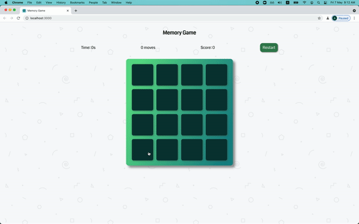

# Memory Game with React

Game finished:

## Colors
- Primary: rgba(96,221,142,1)
- Secondary: rgba(24,138,141,1)
- Gradient from [GradientHunt](https://gradienthunt.com/gradient/22202)

## Steps
1) First I will create the basic layout with - 
    a) Header
    b) Score Bar
    c) Display Area
2) Score Bar would be a component, with logic for - Timer, Score, No. of Moves and Start button
3) Next I will create a component for the game grid.
4) Next I will create the Cell components.
5) In the grid component I will render the cell components with each Individual Cell's data and clickhandler callback.
6) Next I will work on the clickhandler logic. It would contain functions to update the score, reset the tiles and changing color of the tiles
7) Next I will work on the logic of displaying the message on game end. For that purpose I will have a running count of the number of individual icons already paired successfully.
8) Next I will work on the restart button logic

### Edge cases
- Clicking on the same tile twice
- Clicking on another tile while two tiles that you have selected are visible